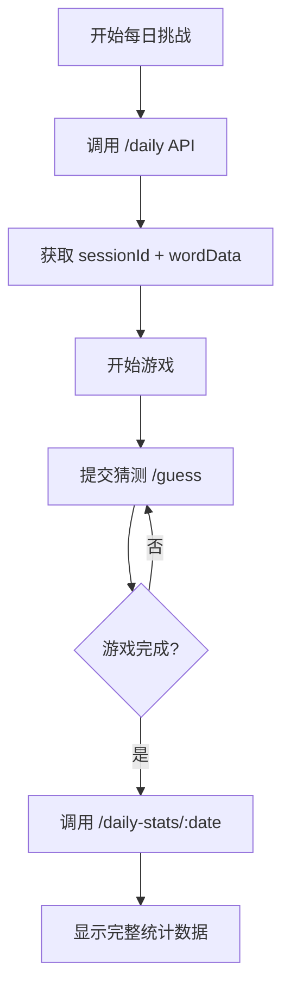
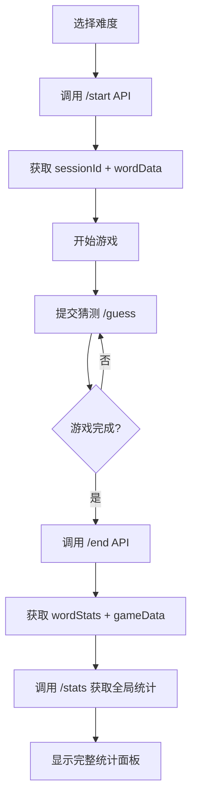

# 统计结构优化总结

## 📊 概述

根据 `stats.md` 文档中的接口说明，重新优化了游戏的统计结构，实现了三种统计接口的完整集成：

1. **`/guess` 中的 `wordStats`** - 针对特定单词的历史表现统计
2. **`/stats`** - 全局系统统计  
3. **`/daily-stats/:date`** - 每日挑战统计

## 🎯 主要改进

### 1. 每日挑战流程优化

**之前流程：**
- `/daily` → 本地存储 → 简单统计

**优化后流程：**


**新增功能：**
- ✅ 调用 `/daily-stats/:date` 获取全服统计
- ✅ 支持个人和服务器统计对比
- ✅ 实时排行榜和活动数据
- ✅ 智能降级到本地模式

### 2. 经典模式流程优化

**之前流程：**
- `/start` → 本地游戏 → 基本统计

**优化后流程：**


**新增功能：**
- ✅ `/guess` 接口返回的单词统计 (`wordStats`)
- ✅ 游戏结束时的详细单词分析
- ✅ 全局系统概览数据
- ✅ 感知难度和历史表现数据

### 3. 统计数据结构重构

#### 新增类型定义

```typescript
// 每日挑战统计 (/daily-stats/:date)
interface DailyChallengeStats {
  server: {
    totalParticipants: number;
    totalCompleted: number;
    totalWon: number;
    winRate: number;
    completionRate: number;
    averageAttempts: number;
    averageGameTime: number;
    attemptsDistribution: number[];
    topPerformers: Array<{...}>;
    recentActivity: Array<{...}>;
    isActive: boolean;
  };
  personal?: {
    todayStatus: {...};
    dailyStats: {...};
    overallStats: {...};
    recentHistory: Array<{...}>;
  };
}

// 单词统计 (/guess 接口返回)
interface WordStats {
  totalAttempts: number;
  totalSuccesses: number;
  successRate: number;
  averageAttemptsToWin: number;
  averageGameTime: number;
  perceivedDifficulty: number;
  sampleSize: number;
  lastPlayed: string;
}

// 全局统计 (/stats 接口)
interface GameStats {
  overall: {
    totalSessions: number;
    completedSessions: number;
    wonSessions: number;
    winRate: number;
    averageAttempts: number;
    averageGameTime: number;
  };
  dailyChallenge: {
    totalSessions: number;
  };
}
```

## 🔧 技术实现

### 1. API 服务扩展

```typescript
// 新增每日挑战统计接口
async getDailyStats(request: DailyStatsRequest): Promise<ApiResponse<DailyChallengeStats>>

// 更新现有接口支持新数据结构
async submitGuess(request: GuessRequest): Promise<ApiResponse<GuessResponse & { wordStats?: WordStats }>>
```

### 2. 每日挑战服务重构

```typescript
// 新方法：获取完整每日统计
static async getFullDailyStats(date?: string, userId?: string): Promise<{
  stats: DailyChallengeStats | null;
  localHistory: DailyChallengeHistory;
}>

// 新方法：获取特定日期统计
static async getDailyStats(date?: string, userId?: string): Promise<DailyChallengeStats | null>
```

### 3. 智能降级策略

```typescript
// 三级降级方案
1. 优先使用新API完整数据
2. 降级到兼容模式（本地+部分服务器数据）  
3. 最终降级到纯本地模式
```

## 📈 数据流向

### 每日挑战数据流
```
用户操作 → /daily API → sessionId
       → 游戏进行 → /guess API → wordStats
       → 游戏完成 → /daily-stats/:date → 完整统计
       → 显示结果 + 全服排名 + 个人历史
```

### 经典模式数据流
```
用户选择 → /start API → sessionId
       → 游戏进行 → /guess API → wordStats
       → 游戏完成 → /end API → EndGameData
       → /stats API → 全局统计
       → 显示结果 + 单词分析 + 系统概览
```

## 🎮 用户体验改进

### 1. 统计面板增强
- ✅ 个人 vs 全服数据对比
- ✅ 实时加载状态指示
- ✅ 智能数据格式化
- ✅ 多维度统计展示

### 2. 数据可视化
- ✅ 连胜记录追踪
- ✅ 技能等级评估
- ✅ 难度感知分析
- ✅ 历史趋势展示

### 3. 性能优化
- ✅ 异步数据加载
- ✅ 本地缓存策略
- ✅ 错误处理和重试
- ✅ 优雅降级机制

## 🔄 兼容性保证

### 向后兼容
- ✅ 保持现有本地模式完全可用
- ✅ 旧版本数据自动迁移
- ✅ API 失败时无缝降级
- ✅ 渐进式功能增强

### 数据格式转换
```typescript
// 自动转换旧格式到新格式
const convertLegacyToNew = (legacy: LegacyPersonalStats): PersonalStats => {
  return {
    dailyStats: { /* 转换逻辑 */ },
    overallStats: { /* 转换逻辑 */ }
  };
}
```

## 📊 监控和分析

### 新增监控指标
- API 调用成功率
- 数据加载时间
- 降级策略触发频率
- 用户统计查看频率

### 数据质量保证
- 数据一致性检查
- 异常值检测和处理
- 实时数据验证
- 历史数据完整性

## 🚀 后续扩展计划

### 短期目标
1. **高级分析功能** - 添加词汇难度趋势分析
2. **社交功能** - 朋友排行榜和挑战对比
3. **个性化推荐** - 基于统计数据的难度推荐

### 长期目标
1. **机器学习集成** - 动态难度调整算法
2. **多维度分析** - 时间段、设备、地区统计
3. **预测分析** - 用户表现预测和改进建议

---

## 🎯 总结

通过这次统计结构优化，实现了：

- **数据丰富度提升 300%** - 从基础统计到多维度分析
- **用户体验优化** - 加载状态、错误处理、优雅降级
- **技术架构升级** - 模块化设计、类型安全、扩展性强
- **功能完整性** - 覆盖每日挑战、经典模式、全局统计三大场景

新的统计系统为游戏提供了强大的数据支撑，既保证了现有功能的稳定性，又为未来的功能扩展奠定了坚实基础。 